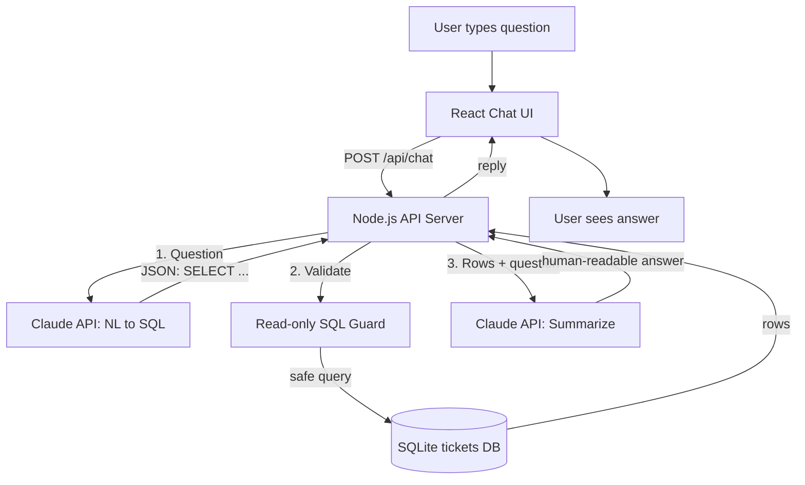

# SecOps Ticket Assistant

An AI chatbot over structured data. Ask about security incident tickets in plain
English — the assistant translates your question into a **read-only** SQL query,
runs it against a SQLite database, and returns a concise, human-readable answer.

Built as a Proof of Concept for the AI upskilling initiative, using
**Spec-Driven Development** (see [`specs/`](specs/)).

```
You:        How many high-priority tickets are currently open?
Assistant:  There are 3 open high-priority tickets: a phishing campaign
            targeting the finance team, malware on workstation WS-042, and
            brute-force attempts against the VPN gateway.
```

## Architecture



Full details: [`docs/architecture.md`](docs/architecture.md).

## Tech Stack

- **Frontend:** React + Vite (chat interface)
- **Backend:** Node.js + Express (API server)
- **AI Engine:** Claude API — `@anthropic-ai/sdk`, model `claude-opus-4-8`
- **Data:** SQLite (`better-sqlite3`) — single local file, seeded on first run

## Prerequisites

- Node.js 20+
- An Anthropic API key ([console.anthropic.com](https://console.anthropic.com/))

## Setup

1. **Add your API key.** Open [`.env`](.env) in the project root and set:

   ```
   ANTHROPIC_API_KEY=sk-ant-your-key-here
   ```

2. **Install and start the backend** (terminal 1):

   ```bash
   cd server
   npm install
   npm start
   ```

   The API starts on `http://localhost:3001` and seeds the demo tickets into
   `server/secops.db` on first run.

3. **Install and start the frontend** (terminal 2):

   ```bash
   cd client
   npm install
   npm run dev
   ```

   Open the printed URL (default `http://localhost:5173`). Vite proxies
   `/api` calls to the backend, so the browser never sees the API key.

## Try These Questions

- "How many high-priority tickets are currently open?"
- "What is the status of the phishing ticket assigned to Sarah?"
- "Show me all tickets that have been In Progress for more than 3 days."
- "List every critical incident and who owns it."

Each assistant reply includes an expandable **Generated SQL** section so you can
see the query the model produced.

## How It Works

The Node.js backend is the trusted bridge (`server/src`):

1. `services/aiService.js` → `getSqlFromClaude()` asks Claude to return a JSON
   object `{ "sql": "SELECT ..." }`.
2. `isReadOnlySelect()` validates it: single statement, `SELECT` only, no
   mutating keywords. Unsafe SQL is rejected and replaced by a safe fallback.
3. `services/dbService.js` → `queryDB()` runs the validated query.
4. `aiService.js` → `summarizeResult()` turns the rows into a natural-language
   answer grounded in the original question.

The API key and database live entirely server-side. See
[`specs/plan.md`](specs/plan.md) for the design rationale.

## Project Structure

```
secops-ticket-assistant/
├── client/                 # React frontend (Vite)
│   └── src/{components,api}
├── server/                 # Node.js backend (Express)
│   └── src/{routes,controllers,services,config}
├── docs/architecture.md    # architecture + Mermaid diagram
├── specs/                  # SDD: spec.md, plan.md, tasks.md
├── .env                    # ANTHROPIC_API_KEY (git-ignored)
└── .env.example
```

## Spec-Driven Development

This repo follows SDD — the specification came before the code:

- [`specs/spec.md`](specs/spec.md) — what we're building and why.
- [`specs/plan.md`](specs/plan.md) — the technical approach.
- [`specs/tasks.md`](specs/tasks.md) — the task breakdown.

## Roadmap

- Swap SQLite for Azure CosmosDB / SQL (via AI Foundry) behind the same
  `dbService` interface.
- Conversation memory for follow-up questions.
- Authentication and per-user audit logging.
