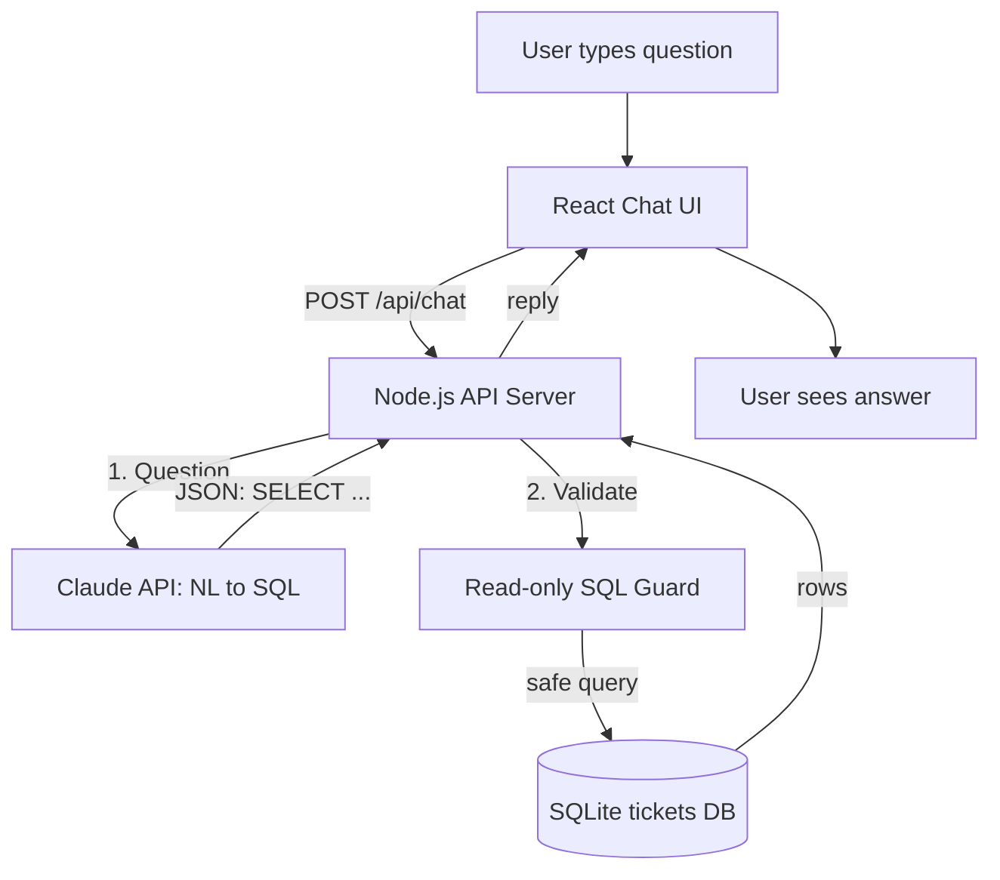

# SecOps Ticket Assistant

An AI chatbot over structured data. Ask about security incident tickets in plain
English — the assistant translates your question into a **read-only** SQL query,
runs it against a SQLite database, and returns a concise, human-readable answer.

Built as a Proof of Concept for the AI upskilling initiative, using
**Spec-Driven Development** (see [`specs/`](specs/)).

```
You:        How many high-priority tickets are currently open?
Assistant:  There are 3 open high-priority tickets: a phishing campaign
            targeting the finance team, malware on workstation WS-042, and
            brute-force attempts against the VPN gateway.
```

## Architecture


Full details: [`docs/architecture.md`](docs/architecture.md).

## Tech Stack

- **Frontend:** React + Vite (chat interface)
- **Backend:** Node.js + Express (API server)
- **AI Engine:** Claude API — `@anthropic-ai/sdk`, model `claude-opus-4-8`
- **Data:** SQLite (`better-sqlite3`) — single local file, seeded on first run

## Prerequisites

- Node.js 20+
- An Anthropic API key ([console.anthropic.com](https://console.anthropic.com/))

## Setup

1. **Add your API key.** Open [`.env`](.env) in the project root and set:
   ```
   ANTHROPIC_API_KEY=sk-ant-your-key-here
   ```

   ```bash
   cd server
   npm start

## Full change description (suitable for Jira / release notes)

Summary
- This work extended the minimal NL→SQL PoC into a RAG-enabled, context-aware
   assistant and added an embeddings prototype plus operational tooling.

Key changes
- Database: added `knowledge_base` with seeded runbook/incident documents and
   a `knowledge_embeddings` table. Helpers include `searchKnowledgeBase()`,
   `getAllKnowledgeDocs()`, `upsertKnowledgeEmbedding()`, `getAllKnowledgeEmbeddings()`.
- Embeddings prototype: added `server/src/services/embeddingsService.js` — a
   lightweight TF sparse-vector index with `buildIndex()` (precomputes vectors)
   and `querySimilarDocs(query, topK)` (returns ranked docs, excerpts, passages).
- RAG & AI: `server/src/services/aiService.js` now exposes `getRagAnswer()` that
   prefers embedding retrieval and falls back to LIKE search. RAG prompts now
   include top passages and require provenance citation (doc id/title/passage).
- Controller & routes: `aiController.js` routes fallback SQL results to the
   RAG path. Added `POST /api/reindex` to rebuild embeddings at runtime.
   The endpoint is protected by `x-reindex-token` which must match the
   `REINDEX_TOKEN` environment variable.
- Frontend: `client/src/api/chat.js` and `client/src/App.jsx` now send session
   `history` to the backend so the assistant can handle follow-up questions.
- Docs & SDD: updated `specs/` and `README.md` with the RAG plan, demo steps,
   and quick start.

How to smoke-test
1. Set env vars in `.env`: `ANTHROPIC_API_KEY` and `REINDEX_TOKEN`.
2. Start backend: `cd server && npm install && npm start` (server builds index).
3. Start frontend: `cd client && npm install && npm run dev`.
4. In the UI, try a structured SQL question and a RAG question. Example RAG
    queries: "What remediation steps are described for a phishing incident?"
5. Reindex after modifying KB: `curl -X POST http://localhost:3001/api/reindex -H "x-reindex-token: your-secret-token"`.

Notes & limitations
- Current embeddings are a PoC TF sparse-vector approach (no external model).
   Accuracy is limited vs model-based embeddings; recommended next step is to
   integrate model embeddings + FAISS/Pinecone/Weaviate.
- The reindex endpoint uses a simple shared token; for stricter security add
   admin auth or IP restrictions.
- Conversation history is session-scoped only; persistent long-term memory is
   intentionally out of scope for this PoC.

   ```

   The API starts on `http://localhost:3001` and seeds the demo tickets into
   `server/secops.db` on first run.

3. **Install and start the frontend** (terminal 2):

   ```bash
   cd client
   npm install
   npm run dev
   ```

   Open the printed URL (default `http://localhost:5173`). Vite proxies
   `/api` calls to the backend, so the browser never sees the API key.

## Try These Questions

- "How many high-priority tickets are currently open?"
- "What is the status of the phishing ticket assigned to Sarah?"
- "Show me all tickets that have been In Progress for more than 3 days."
- "List every critical incident and who owns it."

Each assistant reply includes an expandable **Generated SQL** section so you can
see the query the model produced.

## How It Works

The Node.js backend is the trusted bridge (`server/src`):

1. `services/aiService.js` → `getSqlFromClaude()` asks Claude to return a JSON
   object `{ "sql": "SELECT ..." }`.
2. `isReadOnlySelect()` validates it: single statement, `SELECT` only, no
   mutating keywords. Unsafe SQL is rejected and replaced by a safe fallback.
3. `services/dbService.js` → `queryDB()` runs the validated query.
4. `aiService.js` → `summarizeResult()` turns the rows into a natural-language
   answer grounded in the original question.

The API key and database live entirely server-side. See
[`specs/plan.md`](specs/plan.md) for the design rationale.

## Project Structure

```
secops-ticket-assistant/
├── client/                 # React frontend (Vite)
│   └── src/{components,api}
├── server/                 # Node.js backend (Express)
│   └── src/{routes,controllers,services,config}
├── docs/architecture.md    # architecture + Mermaid diagram
├── specs/                  # SDD: spec.md, plan.md, tasks.md
├── .env                    # ANTHROPIC_API_KEY (git-ignored)
└── .env.example
```

## Spec-Driven Development

This repo follows SDD — the specification came before the code:

- [`specs/spec.md`](specs/spec.md) — what we're building and why.
- [`specs/plan.md`](specs/plan.md) — the technical approach.
- [`specs/tasks.md`](specs/tasks.md) — the task breakdown.

## Roadmap

- Swap SQLite for Azure CosmosDB / SQL (via AI Foundry) behind the same
  `dbService` interface.
- Conversation memory for follow-up questions.
- Authentication and per-user audit logging.

## RAG & Demo Quick Start

This PoC includes a lightweight Retrieval-Augmented Generation (RAG) path
that retrieves relevant documents from a small knowledge base and composes
answers grounded in those documents. The repository ships with a simple
embedding prototype (TF sparse vectors) used to rank documents for the demo.

Quick run steps:

1. Start the backend (builds the local embeddings index on startup):

```bash
cd server
npm install
npm start
```

2. Start the frontend in a separate terminal:

```bash
cd client
npm install
npm run dev
```

3. Try example RAG questions in the chat UI:

- "What remediation steps are described for a phishing incident?"
- "Which tickets mention credential theft indicators?"

Notes:

- The server will precompute a small TF-based embedding index on startup.
   If you add or change documents in the `knowledge_base` table, restart the
   server to rebuild the index (or call the `buildIndex()` function programmatically).
 - To reindex at runtime without restarting, the server exposes a protected
   endpoint `POST /api/reindex`. It requires the header `x-reindex-token` to
   match the `REINDEX_TOKEN` environment variable for security.

Example reindex call (curl):

```bash
curl -X POST http://localhost:3001/api/reindex -H "x-reindex-token: your-secret-token"
```

Set the token in your `.env`:

```
REINDEX_TOKEN=your-secret-token
```
- This embedding prototype is intentionally dependency-free and fast for the
   PoC. For improved relevance, swap the prototype for model-based embeddings
   (OpenAI/Azure) and a vector DB (FAISS, Pinecone, Weaviate).

Demo checklist:

- Show the NL→SQL flow (ask a structured ticket question and show generated SQL).
- Show the RAG flow (ask a runbook or incident-detail question and show the
   assistant answering with cited provenance). The assistant will include a
   short "Provenance" section listing the document ids/titles used.
- Demonstrate a follow-up question to show session-level context handled by
   the backend.

